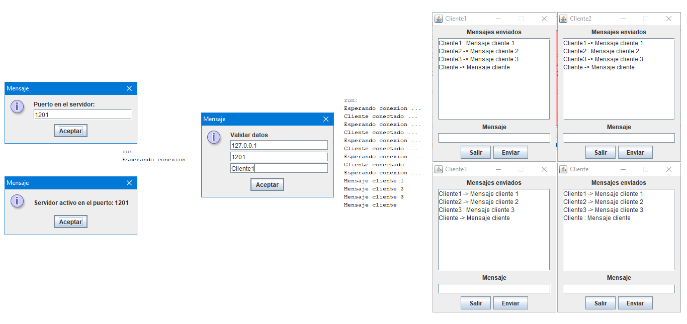

# Chat - Multiples Clientes

## Utilizacion de Hilos y Sockets en Java.

__Programa que representa la conexión en red entre el servidor y clientes a través de sockets:__

* Socket.
* ServerSocket
* Thread.
* BufferedReader.
* BufferedWriter.
* InputStream.
* InputStreamReader.
* OutputStream.
* OutputStreamReader.
* Writer.

